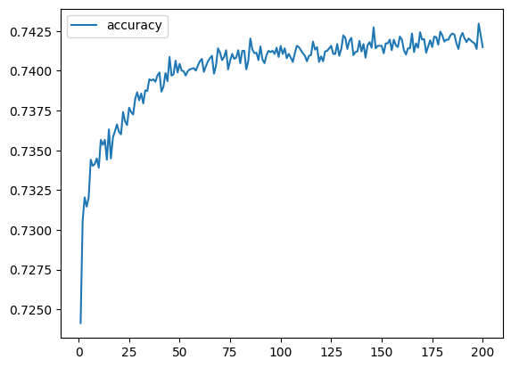

# nonprofit-seeding-deep-learning

## Overview
This project leverages machine learning, deep learning and neural network principles to aid a nonprofit foundation in creating a tool that can select applicants for funding who have the best chance of success in their ventures. We use the features of a dataset provided by the organization to create a binary classifier that can predict whether applicants will be successful if funded. Specifically, we make use of TensorFlow, Keras and Google Colab to implement deep learning techniques that can help us produce a sufficiently accurate predictive tool.

Our starting point is a CSV containing more than 34,000 organizations that have received funding from Alphabet Soup over the years, delivered by the organization's business evaluation team. The dataset features columns that capture metadata about each organization, such as:
- **EIN** and **NAME** — Identification columns
- **APPLICATION_TYPE** — Alphabet Soup application type
- **AFFILIATION** — Affiliated sector of industry
- **CLASSIFICATION** — Government organization classification
- **USE_CASE** — Use case for funding
- **ORGANIZATION** — Organization type
- **STATUS** — Active status
- **INCOME_AMT** — Income classification
- **SPECIAL_CONSIDERATIONS** — Special considerations for application
- **ASK_AMT** — Funding amount requested
- **IS_SUCCESSFUL** — Was the money used effectively

## Procedure

### Preprocess the Data
Preprocess using `Pandas` and `scikit-learn`’s `StandardScaler()`. Preprocessing and v1 model archtecture/training was conducted in Google Colab.
- Read in the charity_data.csv to a Pandas DataFrame, and be sure to identify the following in your dataset:
- Drop the unuseful `EIN` and `NAME` columns.
- Determine the number of unique values for each column.
- For columns that have more than 10 unique values, determine the number of data points for each unique value.
- Use the number of data points for each unique value to pick a cutoff point to bin "rare" categorical variables together in a new value, `Other`, and then check if the binning was successful.
- Employ one hot encoding categorical variables.
- Split the preprocessed data into a features array, X, and a target array, y. Use these arrays and the `.train_test_split()` function to split the data into training and testing datasets.
- Scale the training and testing features datasets by instantiating a `StandardScaler`, fitting it to the training data, and using the `.transform()` function.

### Compile, Train, and Evaluate the Model
- Design a deep learning model to create a binary classification model that can predict if a firm-funded organization will be successful based on the features of the provided dataset.
    - Create a neural network model by assigning the number of input features and nodes for each layer using TensorFlow and Keras.
    - Create the first hidden layer and choose an appropriate activation function.
    - Add a second hidden layer with an appropriate activation function.
    - Create an output layer with an appropriate activation function.
    - Check the structure of the model.

    
    
- Compile and train the model.

- Evaluate the model using the test data to determine the loss and accuracy.
    - _Loss_: 0.5980677604675293
    - _Accuracy_: 0.7286297082901001

- Save and export results to an HDF5 file called `AlphabetSoupCharity.h5`.

**- Compiling, Training and Evaluating**
    - How many neurons, layers, and activation functions did you select for your neural network model, and why?
    - Were you able to achieve the target model performance?
    - What steps did you take in your attempts to increase model performance?

#### Optimize the Model
Our goal here is to optimize our model to achieve a target predictive accuracy higher than 75%.
- Create a new file, `AlphabetSoup_Optimization` with the same structure as our v1 model archtecture.
- Design a new deep learning model with modifications that will optimize to achieve higher than 75% accuracy:
    - Preprocessing
        - Less aggressive binning to account for underfitting
        - Add the `NAME` column back into the dataframe before training
    - Archtecture
        - Change activation functions in hidden layers
        - Reduce number of hidden layers to 1
    - Training
        - Reduce to 100 epochs for the training regimen

- Architecture

    
    
- Training

    

- Evaluate the model using the test data to determine the loss and accuracy.
    - _Loss_: 0.447280615568161
    - _Accuracy_: 0.7807580232620239

    

### Summary

The optimized version of our deep learning model has the following performance characteristics:
    - _Loss_: 0.447280615568161
    - _Accuracy_: 0.7807580232620239

This may be an acceptable level of performance if the Alphabet Soup organization wishes simply to have an automated recommendation system to push applications to human reviwers. If, however, it wishes to fully automate its grant application process, we may need to pursue another model. It may be worth exploring the idea of changing activation functions as well as the architecture of the neural network. For instance, it may be worth exploring recurrent layers, normalization layers, regularizations or other architectural tweaks to determine whether the model could be significantly improved.